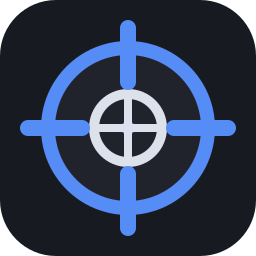

# Recoiless

<p align="center">
  
</p>

Recoiless is a portable Windows accessibility app for configuring mouse movement compensation profiles. It is built as a lightweight C# Windows Forms app with local-only profile storage, game/loadout organization, staged tuning, and hotkey-based switching.

<p align="center">
  <strong>Support this accessibility app</strong><br>
  Recoiless is completely free. If it helps you, you can support development here:<br>
  <a href="https://buymeacoffee.com/nxucs">buymeacoffee.com/nxucs</a>
</p>

> Recoiless is intended for personal accessibility and input-assistance use. Respect the rules and terms of service for any software you use it with.

## Features

- Portable Windows executable, no installer required.
- Local profile database stored in `profiles.xml` beside the executable.
- `profiles.xml` is intentionally ignored by Git and is not included in this repository.
- Multi-game profile database with independent loadouts per game.
- Separate Weapon 1 and Weapon 2 compensation values.
- Four timed recoil stages per profile, each with its own delay and movement values.
- Per-game variance setting for less mechanical movement.
- Optional left-click-only trigger mode.
- Configurable pause key, with double-tap resume behavior.
- F1 app enable/disable toggle.
- F2 silent save shortcut.
- Number row or numpad `1` / `2` weapon switching.
- Per-profile hotkeys with Ctrl, Alt, and Shift modifier support.
- Optional topmost app pin.
- Optional topmost recoil timer overlay with adjustable size.
- Profiles XML import for moving complete setups between installs.
- Dark, borderless, resizable UI.

## Installation and Usage

1. Download the latest release from the [Releases](https://github.com/nxucs/recoiless/releases) tab, or download the latest GitHub Actions artifact.
2. Extract the archive into a folder.
3. Run `Recoiless.exe`.
4. Configure game profiles and weapon profiles.

To move profiles to another install, copy your `profiles.xml` file or use **Profiles Database > Import Profiles XML** in the app.

## Build From Source

Requirements:

- Windows
- .NET Framework 4.x developer tools, including `csc.exe`

Build:

```bat
build.bat
```

The output executable is written to:

```text
Recoiless.exe
```

## GitHub Actions

This repository includes a Windows build workflow at `.github/workflows/build.yml`. Each push or pull request builds the app and uploads `Recoiless.exe` as a workflow artifact.

## Profile Data

User-created profile data lives in `profiles.xml`. That file can contain personal game/loadout configuration, so it is excluded from source control by `.gitignore`.

That `profiles.xml` file is the complete profile/settings database for Recoiless. Copying or importing it is the supported way to transfer all games, loadouts, weapon settings, stage settings, hotkeys, and app profile preferences.

## Repository Layout

```text
Recoiless.cs             Main Windows Forms app
Recoiless.manifest       Requests administrator privileges
assets/                  Crosshair logo and Windows app icon
build.bat                Local Windows build script
.github/workflows/       GitHub Actions CI
```

## License

MIT
